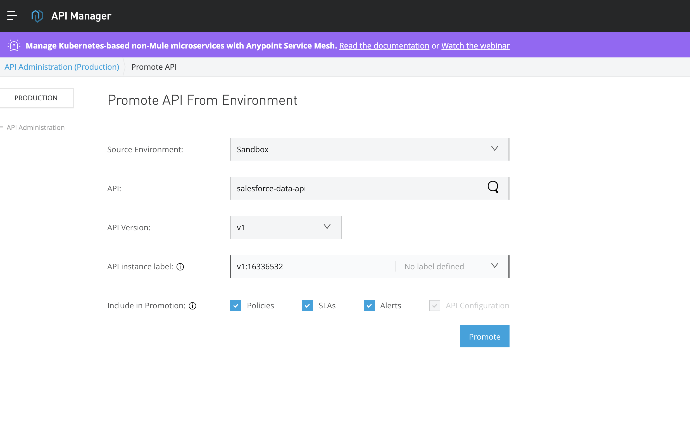

# Scores - Mule Production Deployment Instructions

Production Checklist:

1. App - salesforce-data-api
    1. externalise properties
    2. encrypt credentials and sensitive configs (https://docs.mulesoft.com/mule-runtime/4.3/secure-configuration-properties#parameter-reference)
    3. store decryption key in a safe place
2. Create a proxy in API manager (Basic Endpoint) - prerequisite - RAML specification has to be published to Exchange
    1. Manage API from Exchange
    2. Name - salesforce-data-api (should be the RAML for which the proxy is created)
    3. Basic Endpoint
    4. Mule Application
    5. Mule 4
    6. Implementation URL - [salesforce-data-api-proxy.us-e2.cloudhub.io](http://salesforce-data-api-proxy.us-e2.cloudhub.io/)
    7. Save
    8. Note API Instance ID
3. API Proxy - salesforce-data-api-proxy
    1. Configure API AutoDiscovery on proxy app (salesforce-data-api-proxy) - https://dzone.com/articles/implementing-api-auto-discovery-for-mulesoft-appli
    2. create TLS context (https://docs.mulesoft.com/mule-runtime/4.3/build-an-https-service)
        1. create a keystore (https://blogs.oracle.com/blogbypuneeth/steps-to-create-a-self-signed-certificate-using-openssl)
    3. externalise properties
    4. encrypt credentials and sensitive configs
    5. store decryption key in a safe place

Potential Risk - production.p12 is not stored in Github but it’s uploaded as part of the jar from local. Anyone with access to download jar file from Runtime Manager will have access to p12 file.

salesforce-data-api-proxy deployment steps

1. Check the configuration properties are correct
2. Export jar file from Studio
3. Rename jar file to include the first 7 chars of the commit code e.g. salesforce-data-api-proxy-27f7399.jar
4. Deploy to Cloudhub - Add properties as below - 
    1. anypoint.platform.client_id=<environment-client-id>
    2. ***runtime.decryptionkey=<from lastpass>***
    3. env=sandbox
    4. anypoint.platform.client_secret=<environment-client-secret>
    5. anypoint.platform.config.analytics.agent.enabled=true

**Deploying to Production**

1. Create production VPC
2. API Manager Proxy - salesforce-data-api
    1. Go to API Manager
    2. Switch environment to Production
    3. Promote from Environment
    4. [Image: Screen Shot 2020-08-30 at 1.36.02 pm.png]
    5. Note down the new API instance ID.
    6. make sure the policies have been copied to production environment.
    7. Give access to client app in production
        1. Go to Exchange > salesforce-data-api
        2. Request access
        3. Select Production instance
        4. Create new client app react-app-prod
        5. Request access
        6. Copy the client credentials and store in a safe place.
    8. Create alerts for error response codes and policy violation notifications.
3. API Proxy app - salesforce-data-api-proxy-prod
    1. Go to Runtime Manager
    2. Switch environment to Production
    3. Deploy application
    4. Get from Sandbox and choose the application to promote. check the box for manage runtime version and properties configuration
    5. Update properties as required
    6. Deploy
4. API - salesforce-data-api-prod
    1. Go to Runtime Manager
    2. Switch environment to Production
    3. Deploy application
    4. Get from Sandbox and choose the application to promote. check the box for manage runtime version and properties configuration
    5. Update properties as required
    6. Deploy
    7. create alerts for deployment failures and worker unresponsive notifications

Pending tasks - 

1. what range IP addresses should be used to define CIDR for production vpc
2. write more unit tests
3. end to end tests
4. Mule to salesforce - TLS not implemented

* * *

java -cp secure-properties-tool.jar com.mulesoft.tools.SecurePropertiesTool string encrypt Blowfish CBC mykey changeit

had to move jar file to Desktop. folder to make the command work

java -cp secure-properties-tool.jar com.mulesoft.tools.SecurePropertiesTool string encrypt Blowfish CBC mulesoft changeit 
4Sm5doiOve8kWs7WfTBMGw==

https://help.mulesoft.com/s/article/Unable-to-remove-an-API-due-to-a-The-API-cannot-be-deleted-since-it-has-pending-or-approved-contracts-error

https://help.mulesoft.com/s/article/Application-does-not-Deploy-in-CloudHub-with-error-Cannot-get-OK-response-from-mule-agent-readiness-check-endpoint-for-5-minutes

https://dzone.com/articles/implementing-api-auto-discovery-for-mulesoft-appli

Solution - 

You need to make sure that the below four properties added to your properties file; otherwise API Auto-Discovery will not work.
 Add properties thru Runtime Manager

1. secure properties at rest in code (download secure properties tool jar, encrypt properties individually, put htem in source code and set runtime decryption key)
2. secure runtime properties (hide)
3. create api proxy - auto discovery

