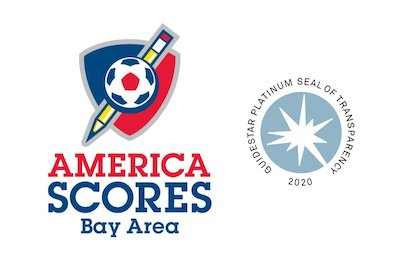

# scoreslabs OS Manifesto

## Open Source Strategy -- Why and How
## Documentation Strategy
Because Communication is Essential to Collaboration
## Overall Values Emphasizing Impact Are Maintained in /Scoreslabs and Designed to Help Developers Discover and Connect
- *America Scores* Mission and Brand are visible and reflected so participants can gain a deep understanding of the long term purpose of their contribution
- Contributions in all forms are acknowledged and verifiable in the assets and repo history. Every effort matters.
- Debates and discussions about values and impact will be supported elsewhere, with the exception of metrics, UX, and data-science subjects which have bearing on implementation choices, may appear in documentation, comments, and projects/issues. This will be tightly moderated.
## Documentation Emphasizes a Relay-Race over a Marathon
- Most contributors are volunteers and as-such need to keep their lives and jobs in order to continue
- Comments and documents must heavily emphasize _onboarding_ and _hand-offs_ so contributors can pick up where we leave off, especially when the interruption is unplanned. _"What if I am unable to finish this?"_ should inform what details we add to inline comments and well as architectural decisions that may not be obvious to the next person who picks up our work.
## Dependancies With Other Repos/Projects are Clear and Traceable ##
- Call out the dependency features, acceptable values/behaviors, and expected availability and link to the repo.
- Consider adding to a list of dependents/subscribers in the counterpart documentation. Start a list if there is none.
- Provide or propose strategies for integration testing

# Why Open Source #
## Benefits to America Scores as an Organization
America Scores in the real world qualifies as an _innovate or die_ organization. Our students and communities are constantly adapting to changes in technology and essential industries. Scores' coaches recognize the evolving needs of their student-poet-athletes and adjust their style and routines, accordingly.
As quickly as these realities change, the tech tools for managing, tracking, measuring, and analyzing which they depend on also need to adapt.
In case any of this is unclear, the conversion of Scores Program from onsite, in-person, daily practices, weekly projects and gamedays, to the COVID19 situation of 2020 literally took place over days, much faster than schools, cities, parks adminstrations, and stakeholder agencies could even begin to react.
Our investment in Open Source is in flexiblity, velocity, and human-centered development.
### Benefits to Scores' Student Population
Open Source development has proven an excellent environment to build _safe and secure technology_. Protecting students in their daily lives requires understanding what's changing, strong collaboration networks, and ability to quickly implement solutions. The analogy to how open source strategy addresses technical security and stability is well-aligned with student safety and futures.
### Benefits to Scores' Coaches
Scores coaches are constantly working to improve their own skills, tools, and processes. They need technology that responds to their evolving needs the same way they respond to their students and teams. Scores coaches not only make important customers, they provide leadership and insight that is rare in most relationships between developers and customers, where one or two stakeholders, or researchers, speak for many. Scores coaches are enabled UX researchers as well as front-line users.
## Data Privacy is a Top Objective ##
While developer efficiency is important, we can't risk exposing private data to the world. This is why we are actively controlling access to teams, repos, and platforms. The [Data Privacy Agreement](https://github.com/AmericaSCORESBayArea/scoreslabs/blob/main/DataPrivacyAgreement.md) is a required read for potential contributors, and we need it signed before we can add you to the team.
### Benefits to Scores' Communities
Among the standard concerns for underserved communities where Scores works, we find:
- Access to Technology
- Privacy
- Technology Literacy
However, the nature of Scores' program further enables a set of needs typically considered out-of-reach in these communities:
- Innovation at the Place of Need
- Technology Strategy and Leadership
- Policy Strategy and Leadership
- Experiments, Creative Technology, Hacking, Repurposing
## Benefits to Impact Organizations and Sector
- Nonprofits active in Open Source typically have a technology-centered objective. Social Impact nonprofits, in particular, depend on discounts from the most established product and platform companies to have access to digital tools at all. 
### Enabling Tech Disruptions
### Re-Enfranchising Target Communities
## Benefits to Developers
### Professional Benefits
In addition to the opportunity to collaborate with smart and experienced developers, we encourage you to make professional connections, respectfully. You may also cite your contributions in your professional resume and online profiles. 
### Personal Benefits
Your contributions here are impactful and meaningful. We will do our best to provide evidence of both the needs we seek to meet as well as evidence of what's been successful and what needs improvement. We encourage both creativity and rigor in everything we do, and personal satisfaction.
## Benefits to the the Tech Industry
Open Source has demonstrated benefits to innovation as well as to major issues facing both Humanity and Industry. We want to follow in the footsteps of pioneers of Open Source, like Mozilla, Apache, Linux...
What we think is novel here is America Scores Bay Area, as a mission-focused nonprofit that is not directly STEM focused. Rather, the skills of self-confidence, communication, teamwork, advocacy, and community service that come from the Soccer-Poetry-Service-Learning program are preparing the future leaders of business, community, and technology. We intend the Students and Coaches gain experience as technology stakeholders and influencers, more than basic consumers
### De-Risking Human Factors
### Impact-Based Development
Rather than measure success by only the familiar product KPI's such as DAU/MAU, Acquisition Costs, Bounces and Referrers, we emphasize indirect and exponential benefits, for example...
- Technology Attention Demand
- Cognitive Load
- Lifestyle Coherence
- School Attendance
### Are We Ready for Open Source Development? ###
The evolving reality of collaborative, open source, looks compellingly like the twin worlds of Education and Athletics (among our favorites, Poetry and Soccer) and we need to bring our intuition from the collaborate realities of Scores Program but also as stakeholders in the future of tech.
- The [OS Readiness Checklist](/OpenSourceReadinessChecklist.md) is our first attempt to establish criteria before making the ScoresLabs repos public.
# How to Contribute
## Develop
Visit our [Contributing](contributing.md) page to learn how to get involved. We need software developers, DevOps specialists, Designers of all types, Writers, and Visionaries. Our [Projects](/projects.md) is also important to understand what we are accomplishing with the work in each repo.
Be sure to sign on to our simple [Developer Agreement](Developer_Agreement.md).
## or Donate
[America Scores Bay Area is a nonprofit 501(c)3 organizations. Your donations on our website](https://www.americascoresbayarea.org/donate) support program delivery and quality for students. This open source effort is part of that strategy, so your donation means better outreach to developers and qualified technology companies as well as supporting coaches, staff, and equipment.
# License
We are presently sharing all repos in the AmericaScoresBayArea organization under a [Creative Commons International 4.0 license](/LICENSE)
