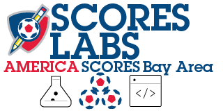

# Contributing to AmericaSCORESBayArea/scoreslabs

## We Have Projects Developers, Designers, Researchers, and Creative Technologists
Every Scores Labs project has a human user, stakeholder, and dependency. We try to be creative in our UX research and support for design, but the UI/UX we start with is typically prototyped first by a developer with very limited and general information about the people who will ultimately depend on it. Then, we try to iterate, discover, and polish. If you are a researcher, designer, data-scientist, artist, or even a game developer, we have something you can contribute to. 
### Send a Request-to-Join to https://github.com/orgs/AmericaSCORESBayArea/teams/os-developers
## Before you Begin
Before you dive in, pay a visit to https://americascoresbayarea.org and https://americascores.org and see who your work will be helping, directly or indirectly.
## Review the active projects in [scoreslabs/Projects](https://github.com/AmericaSCORESBayArea/scoreslabs/blob/main/projects.md)
## Visit the Github Code of Conduct
https://github.com/github/docs/blob/main/CODE_OF_CONDUCT.md
We subscribe to the Github Code of Conduct and enforce its rules in this Org.
### What We Need

#### We need Documentation as well as Design and Code
Most of our projects start as needs in our communities and program. Scores program leaders and coaches are trained problem-solvers, so often the solutions start there. The Developer community needs your expertise in identifying and adding documentation in the project repos.
### Developer Documentation
#### Setup
Help new devs set up their environments for success. What is the right order of steps and/or considerations? What tools do you use that someone else might like to try?
#### Libraries, Snippets, and Components Sourced Elsewhere
What do these external components provide and what, if any, licensing requirements do we need to respect? Call attention to any questionable uses so we can examine them with you.
#### Declarations, Tricks, Rough Exits
Good inline comment practices. Help others quickly get the idea and keep track. If you have exception handling that needs more grace (for users and devs) make a note of it in the code as well as the PR. Consider making a ticket.

### Conceptual Contributions
##### Observation of Need
Documentation starts with an observation of need, followed by a process of temporary and experimental solutions...
#### Explorations, Prototypes, Research
We don't often have time for _analysis paralysis_ but we do have the capacity to try things out. The readiness and passion for collaboration among our coaches means they are prepared to test and give feedback on products and ideas from a very early stage. Remember, coaches are instinctive designers who are also trained observers of human behavior. They will know right away when something is working or when a design is not intuitive, and they will provide professional, unfiltered feedback.
This is why we call the spawning and testing of projects *Scores Labs*.
##### Explorations: Designs, Examples, Disposable Experiments
* _Designs_ are needed to express solutions that developers as well as stakeholders (users) can understand and work with. When a Scores Labs project says `Needs Design` that means a statement of need and/or a user story has been created but there is not enough yet for an interested developer to move forward. This could be provided in an analytical narrative, wireframe describing flow and/or user interface, architecture diagram, or an algorithm/process, like a recipe.
* _Examples_ may provide speedy solutions or ideas already out there. We encourage people to find solid, working technology, especially open source, that can be emulated or integrated. It's even better when leveraging an open source component provides opportunity for improvement and visiblity to that source project as well as our own.
* _Experiments_ are prototypes that can be applied to the need to gather more factual requirements, determine boundary conditions, weaknesses and strengths in the proposed technology. A good experiment will have an hypothesis and clear instructions for how the experiment should be conducted. It's possible that the Scores Labs team will be live-testing an experiment you propose and create, so help us maximize the learnings and opportunity for success.

## Technologies Presently in Use
React.js
iOS and Android
Salesforce
Mulesoft Anypoint
Mulesoft Dataweave
Firebase
Heroku
Tableau
Google Tag Manager, Analytics, Drive, and Data Studio
Zoom

## Types of contributions :memo:
You can contribute in several ways. This repo is where concepts are started and become part of the platform. The ScoresLabs management team makes every effort to provide direction we think will benefit the Scores program, communities, and students, as well as governance to keep everyone safe.
- [Types of contributions :memo:](#types-of-contributions-memo)
  - [:mega: Discussions](#mega-discussions)
  - [:beetle: Issues](#beetle-issues)
  - [:hammer_and_wrench: Pull requests](#hammer_and_wrench-pull-requests)
  - [:question: Support](#question-support)
  - [:earth_asia: Translations](#earth_asia-translations)
  - [:balance_scale: Site Policy](#balance_scale-site-policy)
- [Starting with an issue](#starting-with-an-issue)
  - [Labels](#labels)
- [Opening a pull request](#opening-a-pull-request)
- [Working in the github/docs repository](#working-in-the-githubdocs-repository)
- [Reviewing](#reviewing)
  - [Self review](#self-review)
  - [Pull request template](#pull-request-template)
  - [Suggested changes](#suggested-changes)
  
### :mega: Discussions
Use discussions to collaborate with other contributors

### :beetle: Issues
[Issues](https://github.com/AmericaSCORESBayArea/scoreslabs/issues) are used to track issues that contributors can help with. If an issue has a triage label, we haven't reviewed it yet and you shouldn't begin work on it.

If you've found something in the content or a repo that should be updated, search open issues to see if someone else has reported the same thing. If it's something new, open an issue using a [template](https://github.com/AmericaSCORESBayArea/scoreslabs/issuess/new/choose). We'll use the issue to have a conversation about the problem you want to fix.

### :hammer_and_wrench: Pull requests
A [pull request] [document needed] is a way to suggest changes in our repository.

When we merge those changes, they should be deployed to the live site within 24 hours. :earth_africa: To learn more about opening a pull request in this repo, see [Opening a pull request](#opening-a-pull-request) below.

### :question: Support
We use [Discussions](https://github.com/orgs/AmericaSCORESBayArea/teams/os-developers/discussions) for support issues.

## Starting with an issue
You can browse existing issues to find something that needs help!

## Opening a pull request
You can use the GitHub user interface :pencil2: for some small changes, like fixing a typo or updating a readme. You can also fork the repo and then clone it locally, to view changes and run your tests on your machine.

## Reviewing
We (usually the docs team, but sometimes GitHub product managers, engineers, or supportocats too!) review every single PR. The purpose of reviews is to create the best content we can for people who use GitHub.

:yellow_heart: Reviews are always respectful, acknowledging that everyone did the best possible job with the knowledge they had at the time.  
:yellow_heart: Reviews discuss content, not the person who created it.  
:yellow_heart: Reviews are constructive and start conversation around feedback.  

### Self review
You should always review your own PR first.

For content changes, make sure that you:
- [ ] Confirm that the changes address every part of the content design plan from your issue (if there are differences, explain them).
- [ ] Review the content for technical accuracy.
- [ ] Review the entire pull request using the [localization checklist](contributing/localization-checklist.md).
- [ ] Copy-edit the changes for grammar, spelling, and adherence to the style guide.
- [ ] Check new or updated Liquid statements to confirm that versioning is correct.
- [ ] Check that all of your changes render correctly in staging. Remember, that lists and tables can be tricky.
- [ ] If there are any failing checks in your PR, troubleshoot them until they're all passing.

### Pull request template
When you open a pull request, you must fill out the "Ready for review" template before we can review your PR. This template helps reviewers understand your changes and the purpose of your pull request.

### Suggested changes
We may ask for changes to be made before a PR can be merged, either using [suggested changes](https://docs.github.com/en/github/collaborating-with-issues-and-pull-requests/incorporating-feedback-in-your-pull-request) or pull request comments. You can apply suggested changes directly through the UI. You can make any other changes in your fork, then commit them to your branch.

As you update your PR and apply changes, mark each conversation as [resolved](https://docs.github.com/en/github/collaborating-with-issues-and-pull-requests/commenting-on-a-pull-request#resolving-conversations).

## Joining the OS Developer Team
if we like your PR we will invite you to join the team, which will open access to [discussions](https://github.com/orgs/AmericaSCORESBayArea/teams/os-developers/discussions) and other collaboration.
