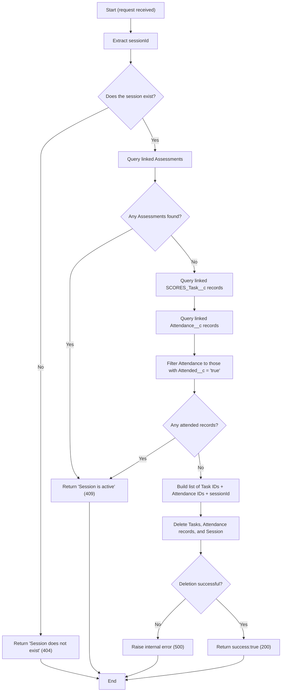

# `DELETE /sessions/{sessionId}`

**Effective Date: May 15, 2025**

This document describes how the system deletes a Session and its related Attendance records.

The deletion is *conditional*: a Session can only be removed when there are **no Assessments** linked to it and **no Attendance records marked as attended** (`Attended__c = "true"`).

---

## Triggering API Action

| HTTP Method | Endpoint                | Description                                                                       |
| ----------- | ----------------------- | --------------------------------------------------------------------------------- |
| `DELETE`    | `/sessions/{sessionId}` | Attempts to delete the specified Session and related records: **tasks** and **attendances**. |

*Path Parameter*

* **`sessionId`** – the Salesforce ID of the `Session__c` record to delete.

---
## Deletion Workflow

