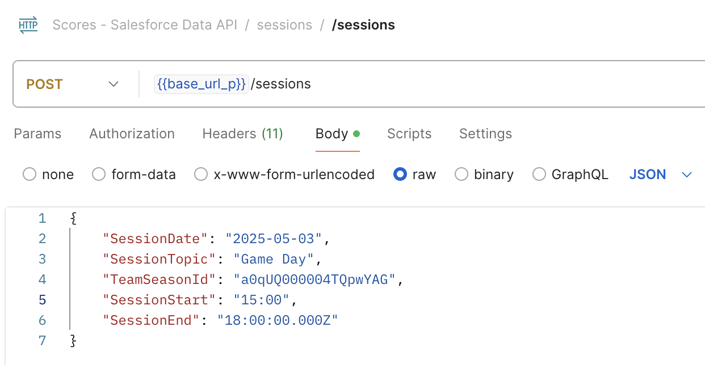
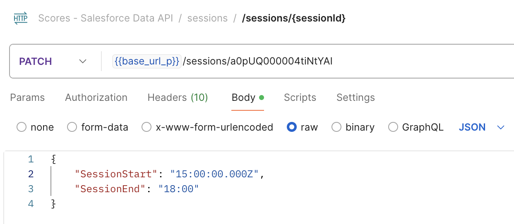
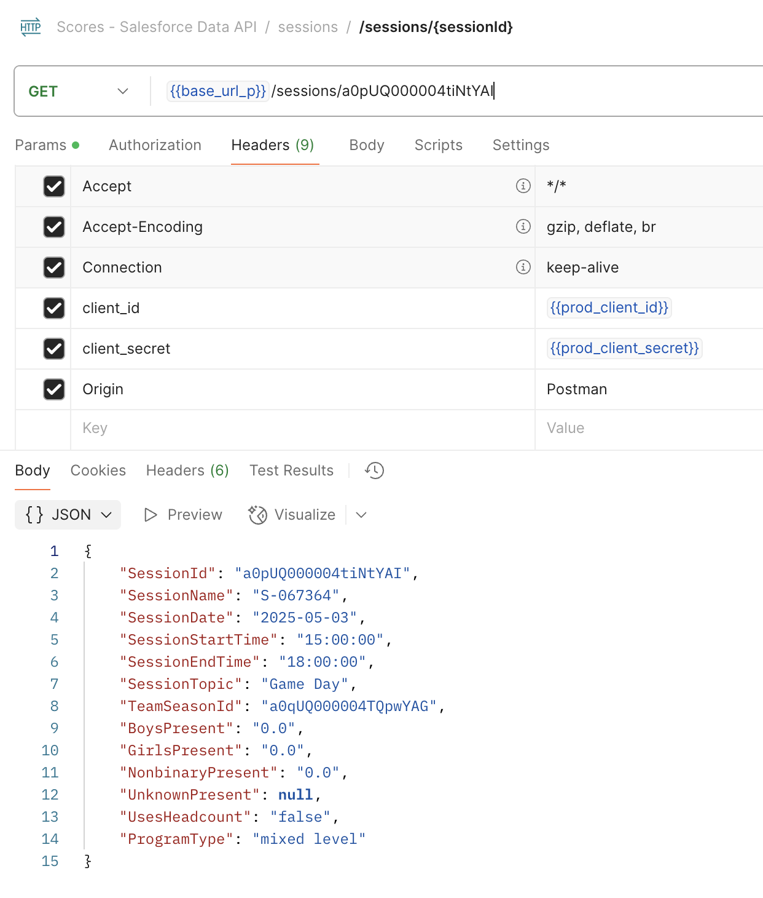

# Sessions. Start Time and End Time

**Effective as of May 1, 2025**

This document outlines how we handle session start and end times across all three levels: **Salesforce database**, **API server**, and **frontend apps**. It can be used as a reference for any other similar cases (for example, any other object that uses `time` field, but not `datetime` or `date`).

## Saleforce

At Salesforce level, we store all times in UTC format, which aligns with Greenwich Mean Time (GMT).

## API Level

The API server also treats all times in UTC format (e.g., `16:00:00.000Z`). Below are examples for the `POST`, `PATCH`, and `GET` methods.

1) **`POST` example**:

2) **`PATCH` example**:

3) **`GET` example**:

## Frontend

In the frontend applications, all session times must be handled with proper conversion to and from UTC:

- **Sending time to the API (`POST`/`PATCH`)**:  
  Convert the local time selected by the user to UTC before sending it to the backend.

- **Receiving time from the API (`GET`)**:  
  Convert the UTC time returned by the backend to the user's local timezone before displaying it in the UI. 

##  Notes

**For Mulesoft (API server) developers:**  
Add `-Duser.timezone=UTC` to your VM arguments when testing or developing the app locally.  This ensures all time conversions behave consistently with how the deployed instances operate.

**Note regarding the Old Coach app and its API Legacy Server:**  
To address time issues with the old Coach app (which we cannot modify), we adjusted the API logic as follows:
- **POST & PATCH**: Add 7 hours to convert California time to UTC.
- **GET**: Subtract 3 hours (a net adjustment of -7h + 4h) to align with the legacy Coach app's behavior.

⚠️ This adjustment ensures correct behavior **only for users in the California timezone**. Besides, this configuration **must** be updated manually when Daylight Saving Time (DST) begins or ends, as the legacy app does not handle DST automatically — at least until the updated Coach app is released.
