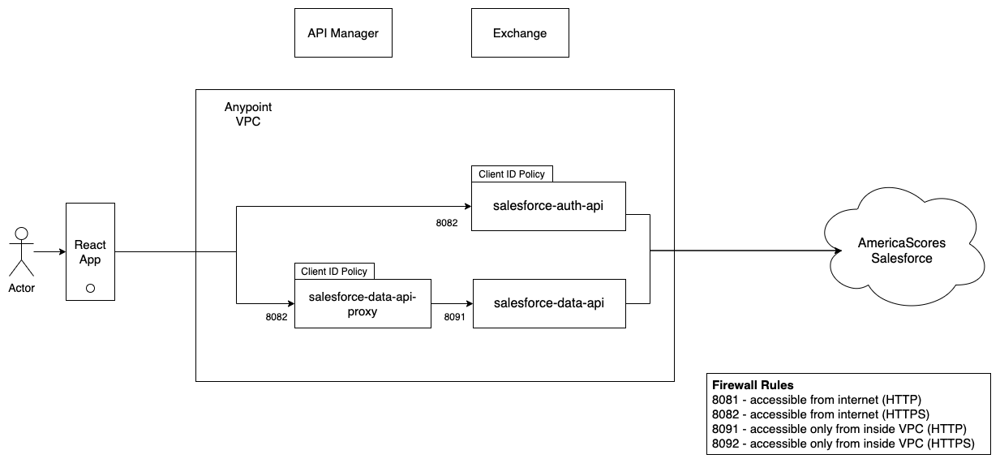

# ScoresLabs Projects Get Started Here

# Project Directory
- [Scores Salesforce Data API](#Scores-Salesforce-Data-API)
- [Salesforce Auth API](#Salesforce-Auth-API)
- [AmericaScores Attendance App](#AmericaScores-attendanceApp)
- [student-registration](#student-registration)
- [External-Sync-Robot](#External-Sync-Robot)

## Latest Releases
| **App**           | **Version** | **Link** | **Commit** | **Comments** |
|-------------------|-------------|----------|------------|--------------|
| Coach App iOS     |             |          |            |              |
| Coach App Android |             |          |            |              |

## Help Needed Immediately
| **Task**                                                                             | **Skill(s)**                           | **Project**                                                                               | **Ticket**                                                                           | **Status**                 |
|--------------------------------------------------------------------------------------|----------------------------------------|-------------------------------------------------------------------------------------------|--------------------------------------------------------------------------------------|----------------------------|
| Design and Configure Salesforce DB to store and track waivers and acceptance history | Salesforce Developer                   | [Salesforce Environment](https://github.com/AmericaSCORESBayArea/salesforce-environment)  | [Story 13](https://github.com/AmericaSCORESBayArea/salesforce-environment/issues/13) | needs help                 |
| Stylize and Deploy for Regions                                                       | React Web                              | [Student Registration](https://github.com/AmericaSCORESBayArea/student-registration)      | [Story 117](https://github.com/AmericaSCORESBayArea/student-registration/issues/117) | Urgent (Heroku exp needed) |
| Design and Implement Enrollment Projections by Team Season                           | Salesforce Development                 | [Salesforce Environment](https://github.com/AmericaSCORESBayArea/salesforce-environment)  | [Story 12](https://github.com/AmericaSCORESBayArea/salesforce-environment/issues/12) | Needs to Start in December |
| Data Infographic Design for Tableau                                                  | Tableau custom Viz/mapping, Web design | [Scores Data Science](https://github.com/AmericaSCORESBayArea/AmericaScores-Data-Science) | TBD                                                                                  | Looking for Design         |

## Salesforce Data API
[AmericaSCORESBayArea/salesforce-data-api](https://github.com/AmericaSCORESBayArea/salesforce-data-api)
### Project Goal
The Data API presently supports all of the external apps. It provides read/create/patch endpoints for important Scores data objects hosted on Salesforce. A new feature will often have a dependency with this API.
#### System Requirements
API behaviors must meet requirements for compatiblity with the Mulesoft Anypoint platorm, as well as meet ScoresLabs requirements for system performance (including resource impact and cost), security, and protection of privacy.
##### Use Case: Family Registration Forms Support Update as Well as Create
The Registration form project requires that returning families be able to retrieve their Contact record from previous seasons, review their needed information [see field list] and make changes to that record, securely.
Additional requirements include:
- Verbose error responses that support debugging
- Dataweave code should include comments developers can easily understand
- Review Mulesoft [Best Practices for API Developers](https://www.mulesoft.com/resources/api/development-best-practices) for additional recommendations
- Supports field-level mappings for different external systems that share reporting

## Overview

## Salesforce Auth API
[salesforce-auth-api](https://github.com/AmericaSCORESBayArea/salesforce-auth-api)
### Project Goal
The Auth API provides simple, friendly 2-Factor Authentication for some users to access apps, using Firebase and Salesforce Contact
#### User Story
Coach opens the Attendance App and authenticats by entering their phone number. After a moment, they receive a code sent to that phone, which they copy-paste into the form to complete the login.
#### Depends on
Firebase API (link?)

## AmericaScores Attendance App
[AmericaSCORESBayArea/AmericaScores-attendanceApp](https://github.com/AmericaSCORESBayArea/AmericaScores-attendanceApp)
### Project Goal
The Attendance App is used by Scores Coaches to track participation by students in Soccer, Poetry/Writing, and Community Service sessions, held at school, online, offsite and on weekends.
It should allow the coaches to track this information efficiently while allowing them to maintain their focus on student experience. The design needs to evolve with the program and conditions. For example, during a weekend soccer match, during an online practice or poetry session, and in situations where connectivity may be lacking.
#### User Story
As a Coach I can quickly select the team I'm working with at the moment, change the session type (e.g. Soccer to Community Ser ice) and see my list of students. With one tap I can mark those who are present and put away my phone for later update, confident the data won't be lost.
##### User Profile/Persona (linked if possible)
[Persona:Scores-Coach]
[Persona:Scores-Student]
#### Depends on
- [Scores Salesforce Data API](#Scores-Salesforce-Data-API)
- [Salesforce Auth API](#Salesforce-Auth-API)

## student-registration
[AmericaSCORESBayArea/student-registration](https://github.com/AmericaSCORESBayArea/student-registration)
### Project Goal
Families need to easily create or update their contact records and accept waivers/releases for their students to participate in the Scores program.
#### User Story
As a Guardian, I can go to a web page on my computer or mobile device and login using my phone number and SMS-code. There I can see my New or Pre-Existing Contact Record and make changes. I can also review and accept waivers/releases and be confident my provacy is being protected.
##### User Profile/Persona (linked if possible)
[Persona:Scores-Family]
[Persona:Scores-Student]
### Depends on
- [Scores Salesforce Data API](#Scores-Salesforce-Data-API)
- [Salesforce Auth API](#Salesforce-Auth-API)

## External-Sync-Robot
[AmericaSCORESBayArea/External-Sync-Robot](https://github.com/AmericaSCORESBayArea/External-Sync-Robot)
### Project Goal
Scores is obligated to share some data on attendance with host school district systems. These systems are sometimes built in a way that provides only a Web front end and no standard API.
The Sync Robot's job is to replace the manual data entry and retrieval process with a periodic automated solution that keeps these databases in snyc.
Several requirements include management of external record ID's, field-mapping and translation, exception management, scheduling, and and administrative interface
### Depends on
- [Scores Salesforce Data API](#Scores-Salesforce-Data-API)
