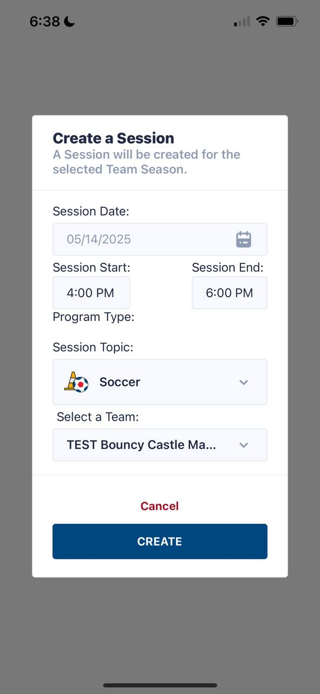
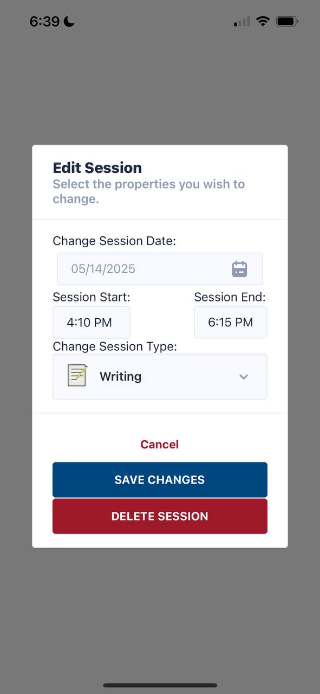
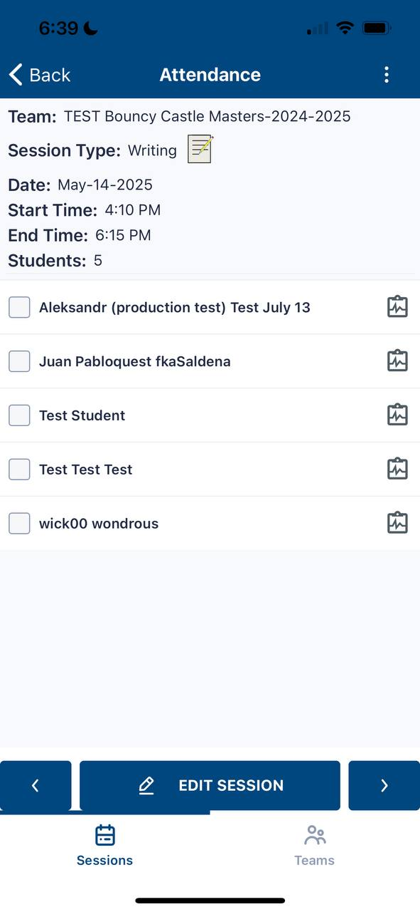
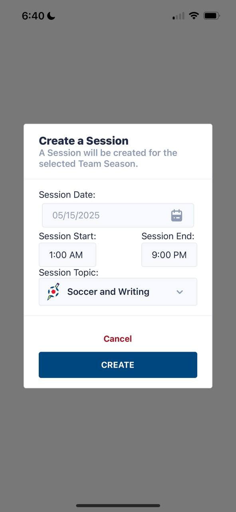
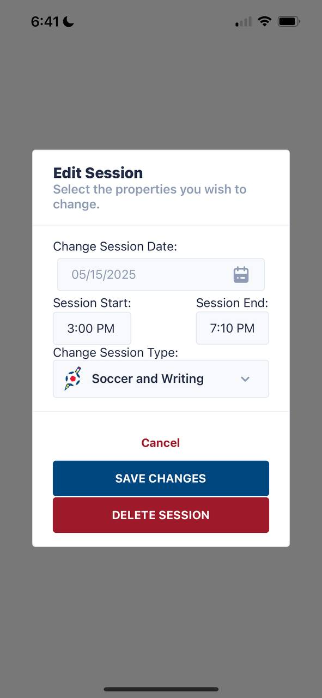
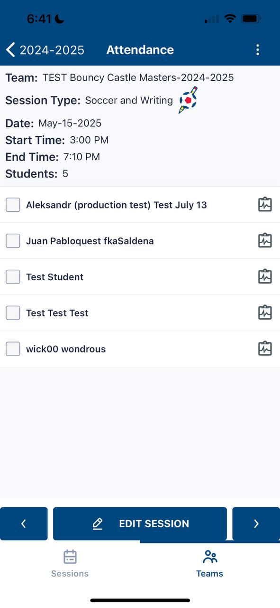

# QA Test: Session Start & End Dates
**Date**: May 4, 2025

The **old Coach app** does not support automated testing. Therefore, the following test must be performed **manually**.

There are two different screens where sessions can be created:

1. **Sessions Screen**
2. **Teams Screen**

>  🛠️ **Note:**  This test performed **after** the patch has been deployed to the legacy server that applies the 3-hour offset: [Patch Commit](https://github.com/AmericaSCORESBayArea/salesforce-data-api/commit/7a0d15c8e969bc68c5163f9751bad93c7b7e478a)

# 1. Sessions Screen

## Create

## View

## Edit

## View

# 2. Teams Screen

## Create

## View

## Edit

## View

