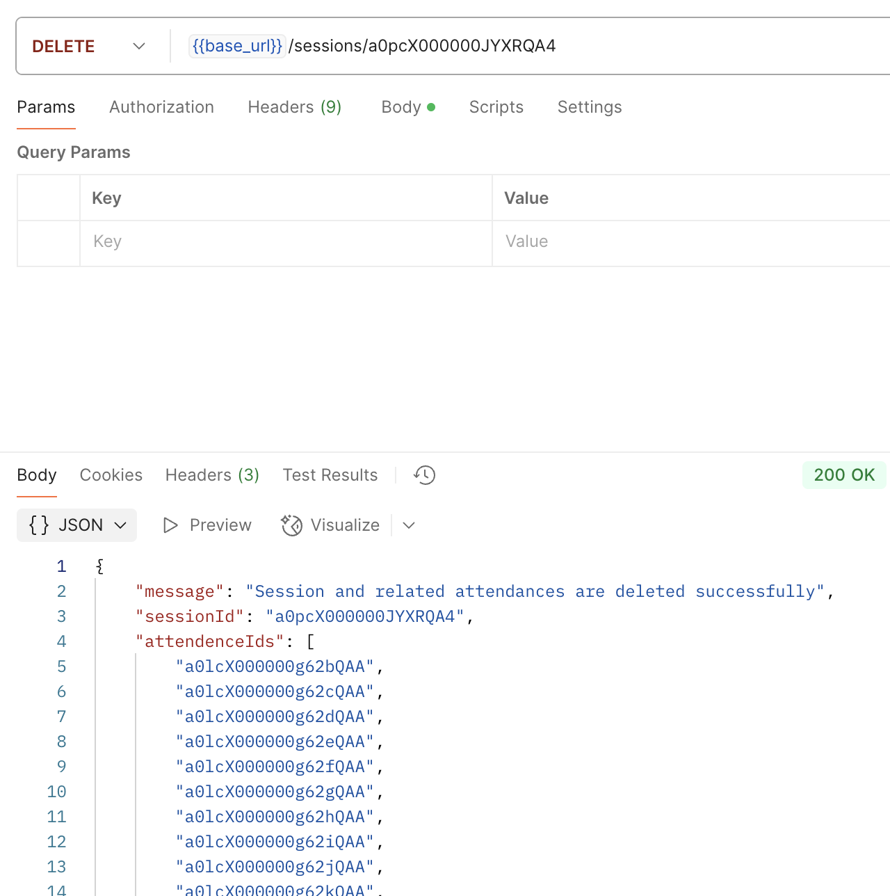
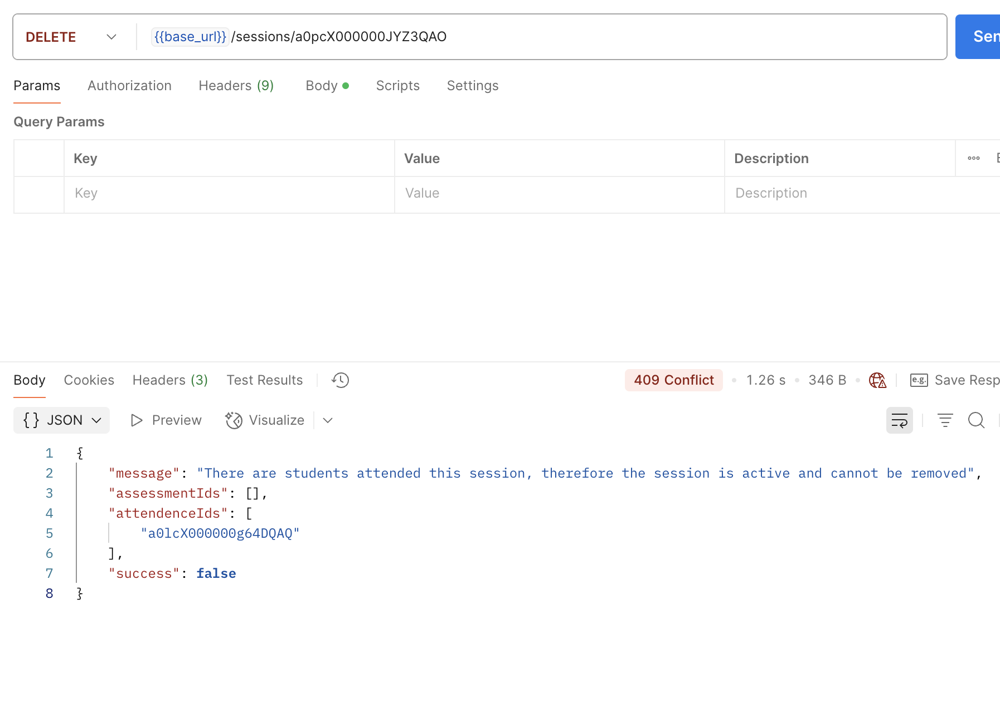
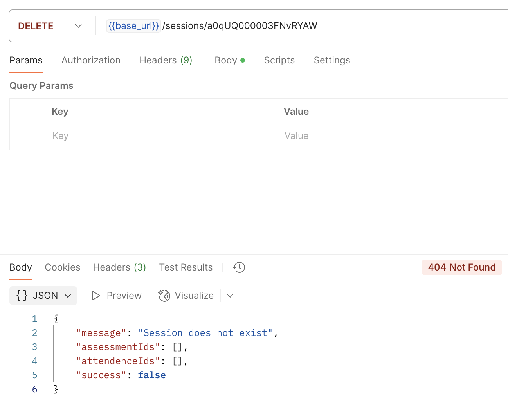

# QA Test: Delete Session

**Date:** May 7, 2025  

These tests verify the functionality of [session deletion](./../../docs/session-delete.md).

---

## Test A – Delete a session with all attendance records marked **false**

**Expected:** The session and all attendance records are deleted.  
**Result:** Confirmed. ✅

---

## Test B – Delete a session with one attendance record marked **true**

**Expected:** The session and attendance records are not removed.  
**Result:** Confirmed. ✅

--- 

## Test C – Delete a session with an incorrect ID (using the ID of a team season)

**Expected:** The session is not found, and the team season is not removed.  
**Result:** Confirmed. ✅
